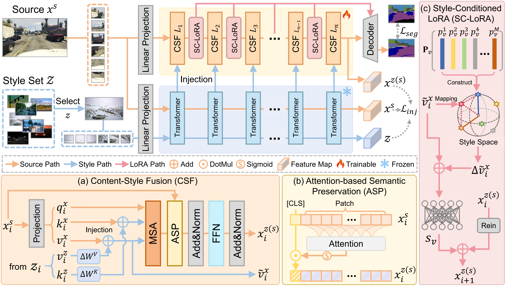

# 🌐 Learning in Diversity: Empowering Domain Generalized Semantic Segmentation with Style Injection

Official implementation of **“Learning in Diversity: Empowering Domain Generalized Semantic Segmentation with Style Injection”**, accepted to **IEEE Transactions on Multimedia (TMM)**, 2025.

---

## 📄 Paper

> **Learning in Diversity: Empowering Domain Generalized Semantic Segmentation with Style Injection**  
> Runtong Zhang, Fanman Meng, Haoran Wei,  Qingbo Wu, Linfeng Xu, Hongliang Li  
> IEEE Transactions on Multimedia, 2025  
> 

---

## 📦 Environment Setup

```bash
conda create -n SID python=3.8 -y
conda activate SID
conda install pytorch==2.0.1 torchvision==0.15.2 torchaudio==2.0.2 pytorch-cuda=11.7 -c pytorch -c nvidia -y
pip install -U openmim
mim install mmengine
mim install "mmcv>=2.0.0"
pip install "mmsegmentation>=1.0.0"
pip install "mmdet>=3.0.0"
pip install xformers=='0.0.20'
pip install -r requirements.txt
pip install future tensorboard
```

---

## 📁 Dataset Preparation

The dataset preparation strictly follows the instructions provided in Rein (CVPR'24):  
👉 [Dataset Preparation Guide](https://github.com/w1oves/Rein)

Please refer to the above link for downloading, organizing, and preprocessing all datasets required for domain generalized semantic segmentation.  
After preparation, your directory structure should look like:

```
SID/
├── datasets/
│   ├── GTAV/
│   ├── Synthia/
│   ├── BDD100K/
│   ├── Cityscapes/
│   ├── Mapillary/
│   ├── StyleSet/
│   └── ...
└── ...
```
Additionally, the **styleset** used in our paper can be downloaded from the following OneDrive link:  
👉 [Styleset Download](YOUR_ONEDRIVE_LINK_HERE)

You may modify the dataset path in the configuration files as needed.

```python
data_root = './configs/_base_/datasets/'
```

---

## 🧩 Pretraining Weights

We provide the pretrained backbone and the final SID model:

| Model | Generalization Setting | Download |
|-------|---------|----------|
| Backbone Pretrained (DinoV2) | - | [Link](#) |
| Ours | GTAV → BDD100K, Cityscapes, Mapillary | [Link](#) |
| Ours | Synthia → BDD100K, Cityscapes, Mapillary  | [Link](#) |

Place them under:

```
SID/
├── checkpoints/
│   ├── dinov2_converted_512x512.pth
│   ├── gta2CMB.pth
│   └── syn2CMB.pth
```

---

## 🚀 Train & Test

### **Training**

To train SID on the source dataset (e.g., Cityscapes):

```bash
python tools/SID_script/train.py --config configs/SID/SID_dinov2_mask2former_512x512_bs1x4.py --work-dir work_dirs/train_log
```

### **Testing**

Evaluate the model on target domains:

```bash
python tools/SID_script/test.py --config configs/SID/SID_dinov2_mask2former_512x512_bs1x4.py --checkpoint /path/to/checkpoint --backbone checkpoints/dinov2_converted_512x512.pth
```

---

## 📚 Citation

If you find this work useful, please consider citing our paper:

```bibtex
@article{SID2025,
  title={Learning in Diversity: Empowering Domain Generalized Semantic Segmentation with Style Injection},
  author={Zhang, Runtong and Meng, Fanman and Wei, Haoran and Wu, Qingbo and Xu, Linfeng and Li, Hongliang},
  journal={IEEE Transactions on Multimedia},
  year={2025}
}
```

---

## 🙏 Acknowledgment

Our implementation is mainly built upon the following repositories, and we gratefully acknowledge the authors for their remarkable work:
* [MMSegmentation](https://github.com/open-mmlab/mmsegmentation)
* [Rein](https://github.com/w1oves/Rein)
* [DDB](https://github.com/xiaoachen98/DDB)

We sincerely appreciate the open-source community for their valuable contributions and efforts.


